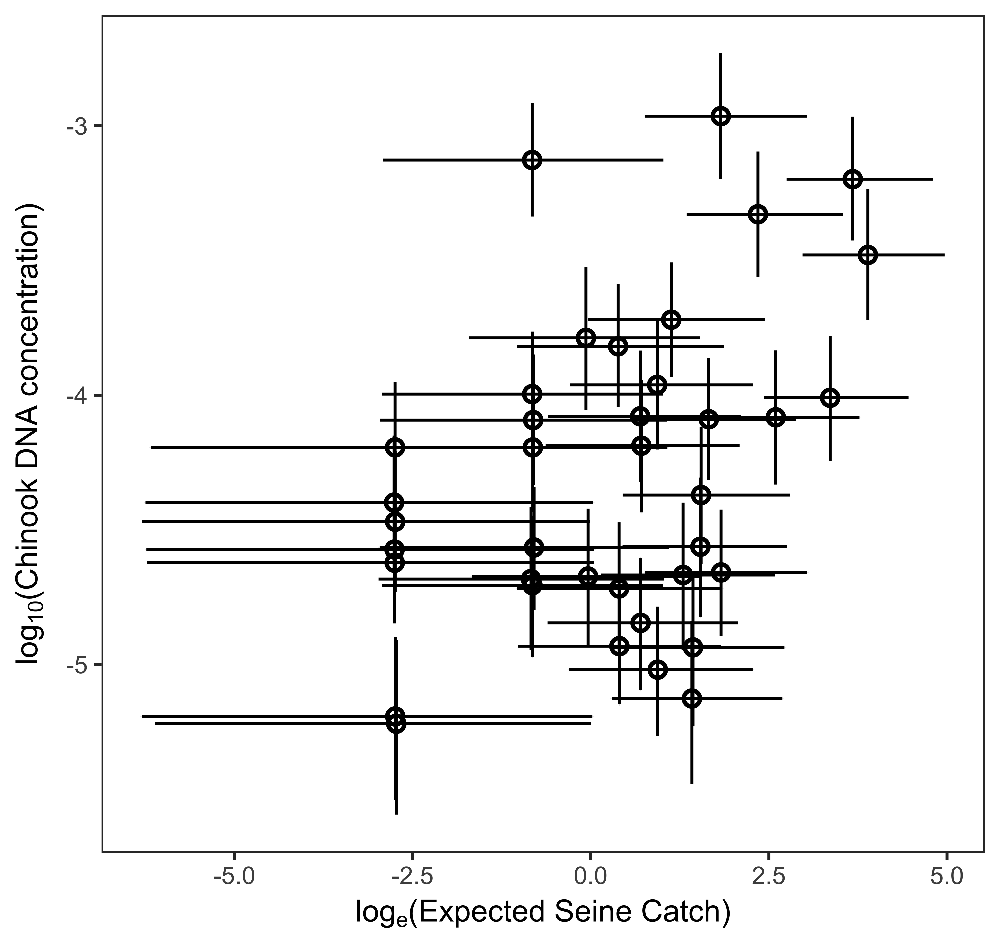
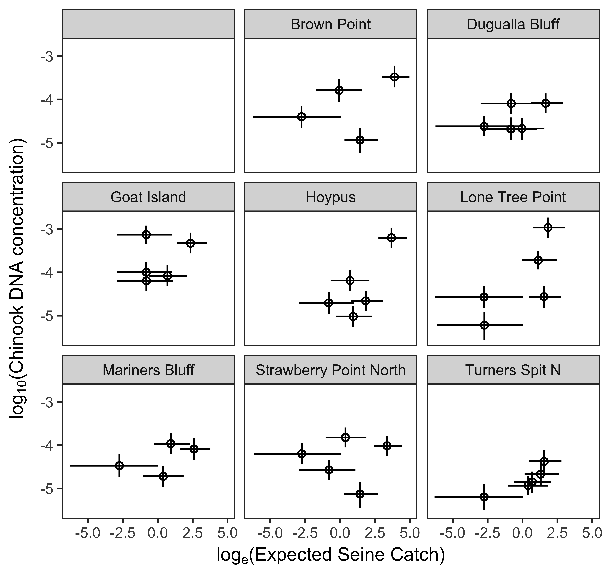

```{r setup, include=FALSE}
knitr::opts_chunk$set(echo = FALSE)
```

Andrew Olaf Shelton, Ryan Kelly esquire, Good doctor Linda Park, Piper "P-Diddy" Schwenke, James L. O'Donnell, Correigh Greene, others.

\pagebreak

## Abstract
Species of conservation and ecological interest are often rare or mobile, making it difficult to count them, and making time-series sampling especially labor-intensive. Sampling genetic traces of such species from environmental media such as water, air, or soil (environmental DNA or eDNA) is an increasingly common means of surveying, because this technique is sensitive, noninvasive, and cost-effective. However, eDNA is a completely different sampling regime than traditional methods such as visual, net, or quadrat surveys, and as a result, it is not clear whether or how to compare the results of genetic and traditional surveys. Here, we present the results of parallel seine-net and quantitative-PCR (qPCR) time-series surveys of Chinook (Oncorhynchus tshawytscha) and Coho (O. kisutch) salmon from Skagit Bay, an estuarine nearshore habitat of Puget Sound, Washington, USA. The former species is listed as threatened under the U.S. Endangered Species Act, and is closely monitored by NOAA. We use a highly replicated survey design to identify sources of variance in fish counts (net surveys) and eDNA copy number (qPCR) over space and time; we then use these variance estimates to interpret trends in each survey result over space and time over the course of a seasonal salmon migration through the estuarine habitat. We develop models for relating qPCR to seine-net results at two different spatial scales and assess spatial autocorrelation for each survey technique over the study area. [In general, we find that eDNA closely reflects the seasonal pulse in salmonids—explaining XX% of the variance at the estuary scale—and that it is more smoothly distributed over the sampled area than are observed fish.] 

\pagebreak

## Introduction

## Methods

General overview of methods.


There are four discrete steps to our qPCR methodology: (1) Environmental sample collection, (2) isolation of particulates from water via filtration, (3) isolation of DNA from filter membrane, and (4) amplification of target locus via PCR. We provide brief overviews of these steps here, and encourage the reader to review the fully detailed methods presented in the supplementary material (CITE SUPPLEMENT). After the laboratory component 

REPLICATION IS A BIG DEAL.


### Field Sampling
#### Beach Seine and water collection

FROM JIMMY:
we collected water samples at the surface… (Figure *site_map*). To destroy residual DNA on equipment used for field sampling and filtration, we washed with a 1:10 solution of household bleach (8.25\% sodium hypochlorite; 7.25\% available chlorine) and deionized water, followed by thorough rinsing with deionized water. Each environmental sample was collected in a clean 1 liter high-density polyethylene bottle, the opening of which was covered with 500 micrometer nylon mesh to prevent entry of larger particles. Immediately after collecting the sample, the mesh was replaced with a clean lid and the sample was held on ice until filtering. To assess the extent of sample cross-contamination in the field, we filled one bottle with deionized water before each sampling day, opened and closed it in the field, and treated it identically to the samples for the remainder of the steps.


#### Filtration and DNA extraction

FILTRATION
1 liter from each water sample was filtered in the lab on a sterile filter cup fitted with a 47 millimeter diameter cellulose acetate membrane with 0.45 micrometer pores (Sterilitech #AF045W50). Filter membranes were moved into 1300 microliters of Longmire buffer (CITE LONGMIRE) using clean forceps and stored at room temperature (CITE Renshaw2015). To test for the extent of contamination attributable to laboratory procedures, we filtered three replicate 1 liter samples of deionized water. These samples were treated identically to the environmental samples throughout the remaining protocols. 

DNA PURIFICATION
DNA was purified from the membrane following a phenol:chloroform:isoamyl alcohol protocol following Renshaw (CITE RENSHAW). Preserved membranes were incubated at 65C for 30 minutes before adding 900 microliters of phenol:chloroform:isoamyl alcohol and shaking vigorously for 60 seconds. We conducted two consecutive chloroform washes by centrifuging at 14,000 rpm for 5 minutes, transferring the aqueous layer to 700 microliters chloroform, and shaking vigorously for 60 seconds. After a third centrifugation, 500 microliters of the aqueous layer was transferred to tubes containing 20 microliters 5 molar NaCl and 500 microliters 100\% isopropanol, and frozen at -20C for approximately 15 hours. Finally, all liquid was removed by centrifuging at 14000 rpm for 10 minutes, pouring off or pipetting out any remaining liquid, and drying in a vacuum centrifuge at 45C for 15 minutes. DNA was resuspended in 200 microliters of ultrapure water. Genomic DNA extracted from tissue of a species absent from the sampled environment (Poecilia wingei) served as positive control for the remaining protocols. 


#### Statistical Methods for qPCR results


Constructing a joint statistical model for all observations provides several advantages. First, joint models appropriately propagate uncertainty through the qPCR analyses from the regression analysis of the DNA dilution series to the estimates of DNA concentration in field samples. Standard analyses of qPCR data typically ignore uncertainty in the relationship between the density of DNA in the dilution series standard, resulting in estimates of field samples ignore that are less precise and potentially biased. Furthermore, constructing a joint model enables distinct processes to be modeled explicitly and compared, allowing the identification of processes that contribute  uncertainty. Finally, we can construct a parallel model for data derived from beach seine samples, enabling a formal comparison between sampling methods using parallel statistical models.


Following general practice with quantitative PCR, for each of $q=1,2,...,5$ quantitative PCR plates, we ran a dilution series of known Chinook salmon concentrations (densities, $D$, between 10-1 and 10-7 $\mu g$ $\mu L^{-1}$) to estimate the density of Chinook salmon DNA in field collections. We observe the estimated PCR cycle, $C_{iq}$, at which replicate PCR reaction i crossed THIS THRESHOLD (appropriate verbiage here). Then we can estimate regression coefficients $\boldsymbol{beta}$ that determine the relationship between known DNA concentration and counts,
$$C_{iq} \sim Normal(\beta_{0q} +\beta_{1q} [\log_{10} D_{qi} ],\sigma^2 )$$
For some concentrations of the standard and some field samples, no PCR amplification was observed. We wanted to include this information in our model as there is no logical reason to exclude the information held in these observations, so we added a presence-absence component, using logistic regression to model the probability of occurrence, $\theta_{iq}$,
$$
\begin{aligned}
  & Y_{iq} \sim Bernoulli(\theta_{iq}) \\
  & logit(\theta_{iq})= \phi_{0q} +\phi_{1q} [\log_{10} D_{qi} ]
\end{aligned}
$$
where $\boldsymbol{\phi}$are regression coefficients and  $Y_{iq}=1$ if PCR amplification was observed and $Y_{iq}=0$ otherwise.
	For the field samples, the concentration of Chinook salmon DNA is unknown and the object of interest.  We define $\gamma_st$ as the true $\log_{10}$ Chinook DNA concentration at each site, $s$, in month, $t$. Let $\delta_{bst}$ represent the deviation for each replicate bottle, $b$, collected at each site-month combination so that the log10 Chinook DNA concentration is
$$
\begin{aligned}
  & \log_{10} D_{bst}=\gamma_{st}+ \delta_{bst} \\
  & \delta_{bst} \sim Normal(0,\tau^2) 
\end{aligned}
$$
Here, $\tau^2$ represents the small scale (10s of meters, 10s of minutes), among-bottle variance in DNA concentration at a given site-month combination. In parallel to the likelihood for the dilution standard, we can connect the estimated Chinook DNA concentration to the observed PCR counts,
$$C_{ibstq} \sim Normal(\beta_{0q} +\beta_{1q} [\log_{10} D_{bst} ],\sigma^2 +\omega^2 )$$
Here, $\omega^2$ is the additional variance in counts attributable to laboratory processing of the field samples beyond the variance contributed by the standards. We can write the contribution of the presence component of the field samples as well 
$$
\begin{aligned}
  & Y_{ibstq} \sim Bernoulli(\theta_{bstq}) \\
  & logit(\theta_{bstq})= \phi_{0q} +\phi_{1q} [\log_{10} D_{bst} ]
\end{aligned}
$$

Given this statistical model, we are primarily interested in the estimates of the Chinook DNA concentration at each site-month combination, $\gamma_{st}$.  Additionally, we are interested in the parameters that reveal the contribution of distinct processes to variation in Chinook DNA density. For the qPCR analyses we have two processes that contriute to the variability in observed qPCR counts $\sigma^2$ and $\omega^2$ while the other 

#### Constructing indices of abundance


####Estimation
We  estimated both the qPCR and beach seine model statistical model in STAN (REF) as implemented in the R environment (rstan; v.2.16.2, REF). STAN is a Hamiltonian Markov Chain Monte Carlo sampler for (see this ref for a description targeted at Ecologists... UW guy)  For both the beach seine and qPCR analyses we used 5 parallel chains with diffuse starting locations and examined Gelman-Rubin diagnostics and   We used diffuse prior distributions for all parameters in the online supplemtn and provide all code necessary for analysis and plotting in THIS ONLINE LOCATION.

at each site in each month is the object of interest


## Results
```{r, echo=FALSE}
load("Output for rmarkdown.RData")
print(Output.rmarkdown$pair.corr)
```


## Discussion

### Figures

ALL ERROR BARS ARE 90% Credible intervals

```{r, echo=FALSE,fig.pairwise.log,out.width='80%'}

```
```{r, echo=FALSE,fig.index.stand,out.width='80%'}
knitr::include_graphics("../Figures/Pub Figs/Fig index plots.jpeg")
```


### Supplementary Figures
```{r, echo=FALSE,fig.pairwise.log.facet,out.width='80%'}

```

